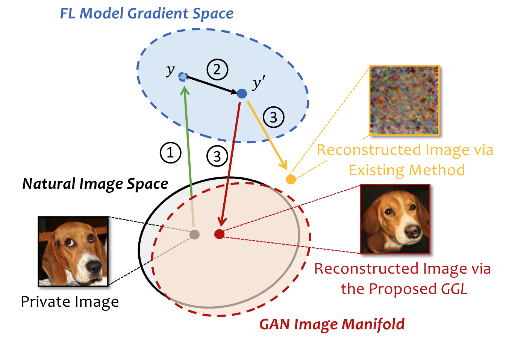
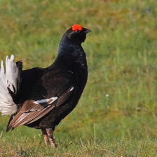
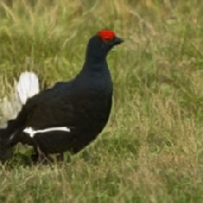

# Auditing Privacy Defenses in Federated Learning via Generative Gradient Leakage

[](https://opensource.org/licenses/MIT)

A pytorch implementation of the attack described in the paper
> [Auditing Privacy Defenses in Federated Learning via Generative Gradient Leakage](https://arxiv.org/pdf/2203.15696.pdf) 
>      
> Author: *Zhuohang Li* (University of Tennessee, Knoxville), *Jiaxin Zhang* (Oak Ridge National Laboratory), *Luyang Liu* (Google Research), *Jian Liu* (University of Tennessee, Knoxville) 
> 
> Email: zli96@vols.utk.edu, zhangj@ornl.gov, luyangliu@google.com, jliu@utk.edu

## Introduction

To protect user’s privacy in federated learning, several defense mechanisms have been proposed to prevent privacy leakage via gradient information degradation. We validate that the private training data can still be leaked under certain defense settings with a new type of leakage, i.e., Generative Gradient Leakage (GGL), which leverages the latent space of generative adversarial networks (GAN) learned from public image datasets as a prior to compensate for the informational loss during gradient degradation. We hope the proposed method can serve as a tool for empirically measuring the amount of privacy leakage to facilitate the design of more robust defense mechanisms.

<p align="center">

</p>


## Getting started

### Requirements
* python 3.7
* torch >=1.4.0
* Other dependencies: `pip install -r requirements.txt`


### Preparation
Download the [CelebA](https://mmlab.ie.cuhk.edu.hk/projects/CelebA.html) and [ImageNet](https://www.image-net.org/) dataset and provide path to the downloaded data files and pretrained generative model in `constants.py` (training proceedure is provided in `GAN-training/wgan-gp_celeba.ipynb`).

### Run
A notebook example is provided in `ImageNet-ng.ipynb`.

To run experiment on the CelebA dataset in Command Line Interface, use
```
python celeba32_wgan-gp.py --n_trials 1 --budget 500 --ng_method CMA --exp_name CMA_no_defense
```

To run experiment on the ImageNet dataset, use
```
python imagenet_biggan.py --n_trials 1 --budget 500 --ng_method CMA --exp_name CMA_no_defense
```

To evaluate adaptive attack against defense with a chosen parameter, use
```
python imagenet_biggan.py --gpu 0 --n_trials 1 --budget 500 --defense compression --d_param 90 --ng_method CMA --exp_name CMA_compression_90_ada --adaptive
```

### Result

<p align="center">


</p>
<p align = "center">
Left: Orignal image, Right: Reconstructed image from sparse gradients
</p>


## Acknowledgement

Part of the code is adapted from [Inverting Gradients](https://github.com/JonasGeiping/invertinggradients) and [Soteria](https://github.com/jeremy313/Soteria). The BigGAN implementation and pretrained weights are from [PyTorch pretrained BigGAN](https://github.com/huggingface/pytorch-pretrained-BigGAN). For Bayesian otimization, we used [TuRBO](https://github.com/uber-research/TuRBO).

## References
If you find the code useful for your research, please consider citing
```
@inproceedings{
  li2022auditing,
  title={Auditing Privacy Defenses in Federated Learning via Generative Gradient Leakage},
  author={Li, Zhuohang and Zhang, Jiaxin and Liu, Luyang and Liu, Jian},
  booktitle={IEEE/CVF Conference on Computer Vision and Pattern Recognition (CVPR 2022)},
  year={2022},
  url={https://arxiv.org/abs/2203.15696}
}
```
